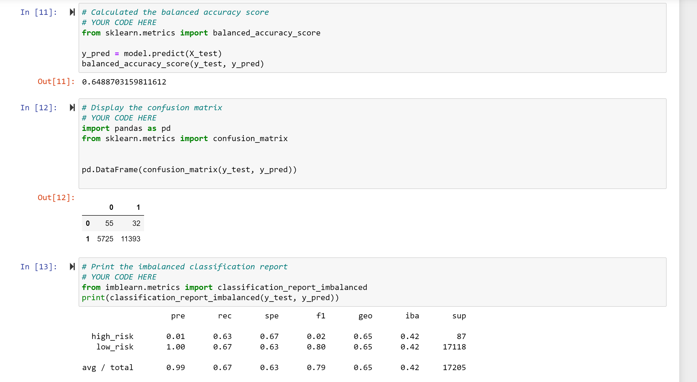
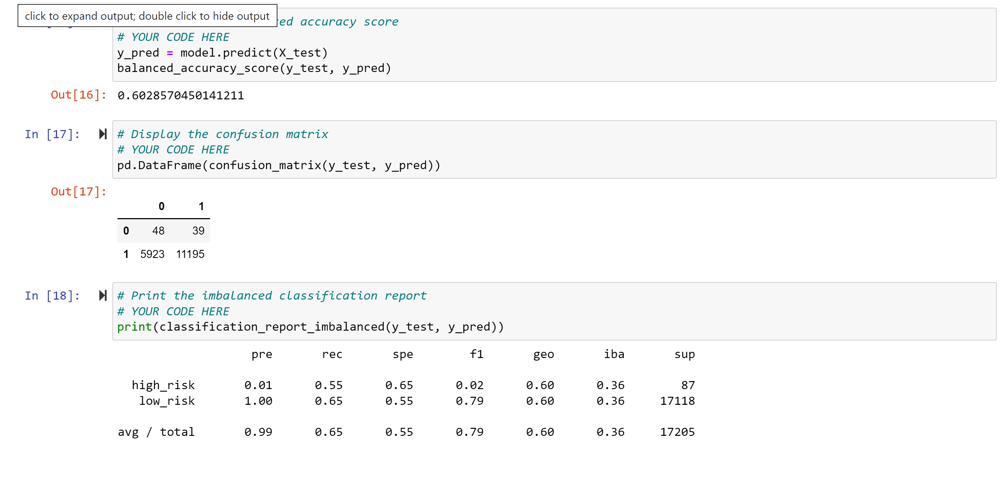
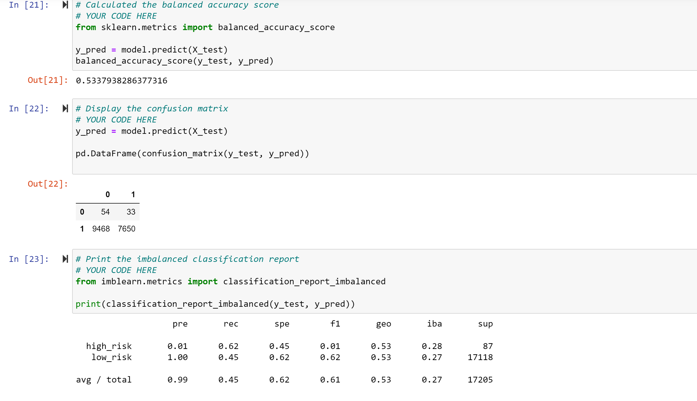
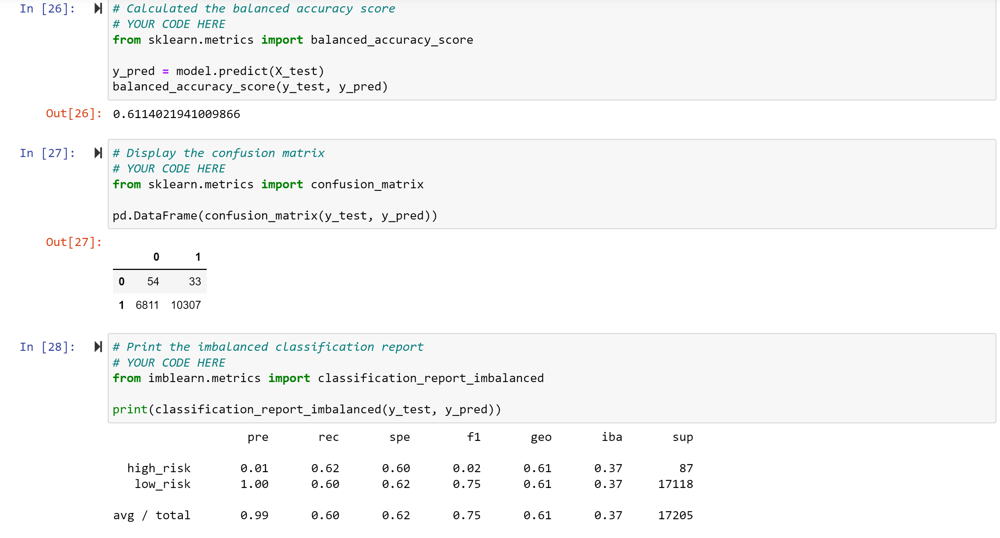
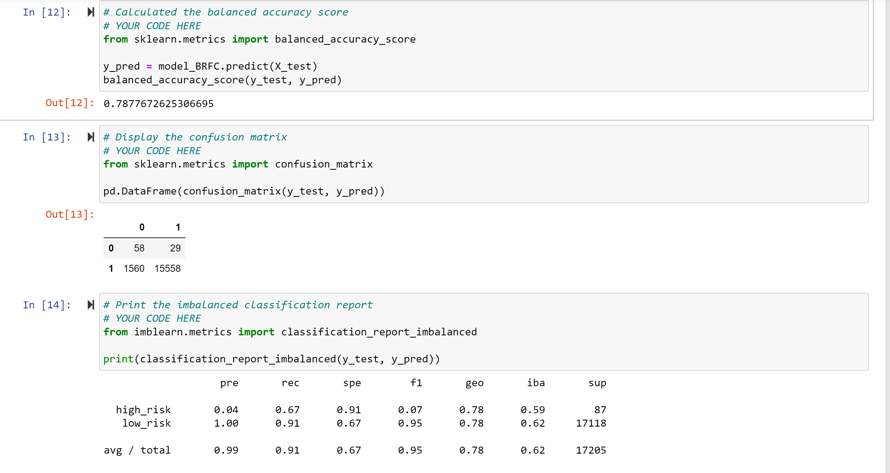
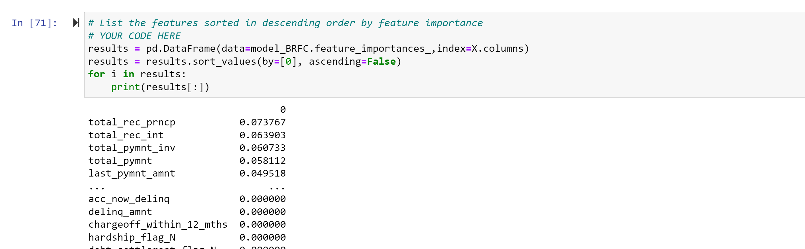
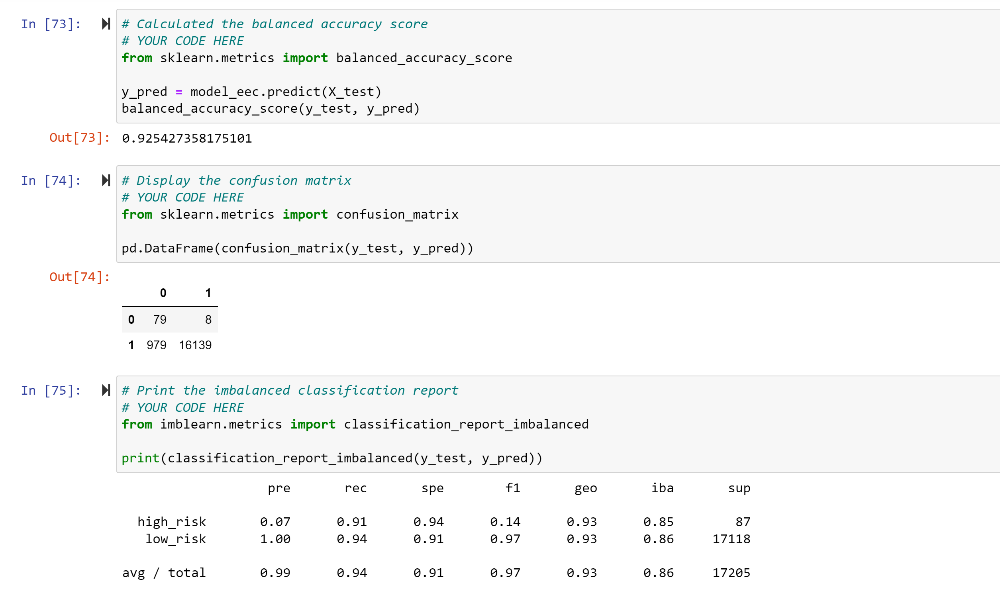

# Credit_Risk_Analysis:  By David Matheny:  Date 4/10/2022

# Overview of the analysis:  
Jill asked me to use imbalanced-learn and scikit-learn libraries to build and evaluate models using resampling. Using the credit card credit dataset from LendingClub, a peer-to-peer lending services company, you’ll oversample the data using the RandomOverSampler and SMOTE algorithms, and undersample the data using the ClusterCentroids algorithm. Then, you’ll use a combinatorial approach of over- and undersampling using the SMOTEENN algorithm. Next, you’ll compare two new machine learning models that reduce bias, BalancedRandomForestClassifier and EasyEnsembleClassifier, to predict credit risk. Once you’re done, you’ll evaluate the performance of these models and make a written recommendation on whether they should be used to predict credit risk.

# Results:

## Deliverable 1:

### RandomOverSampler
An accuracy score for the model is calculated(see pic below) 
A confusion matrix has been generated(see pic below)  
An imbalanced classification report has been generate(see pic below) 

### SMOTE
An accuracy score for the model is calculated(see pic below) 
A confusion matrix has been generated(see pic below)  
An imbalanced classification report has been generate(see pic below) 

### ClusterCentroids
An accuracy score for the model is calculated(see pic below) 
A confusion matrix has been generated(see pic below)  
An imbalanced classification report has been generate(see pic below) 

## Deliverable 2:

### SMOTEENN
An accuracy score for the model is calculated(see pic below) 
A confusion matrix has been generated(see pic below)  
An imbalanced classification report has been generate(see pic below) 

## Deliverable 3:

### BalancedRandomForestClassifier
An accuracy score for the model is calculated(see pic below) 
A confusion matrix has been generated(see pic below)  
An imbalanced classification report has been generate(see pic below) 
The features are sorted in descending order by feature importance

### EasyEnsembleClassifier
An accuracy score for the model is calculated(see pic below) 
A confusion matrix has been generated(see pic below)  
An imbalanced classification report has been generate(see pic below) 

## Summary
When reviewing the models, I would go with the EasyEnsembleClassifier model.  The EasyEnsembleClassifier had an accuracy of 92% much higher than the other models.  It also had the best precision, recall and f1 score.  I would recommed getting more data, we have far too little data to draw results.  I would also try other things like onehotencode instead of dummies and possible check to see if we need to clean the data.  And most important I would speak with a domanin expert(in the industry) NOT A DATASCIENTIST or PROGRAMMER to confirm and validate that the results pass the sniff test.

